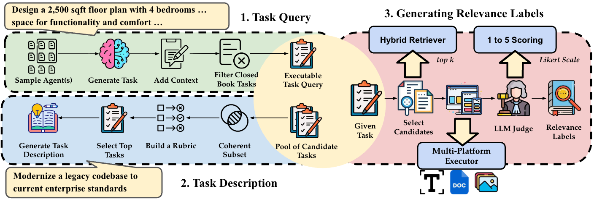

<div align= "center">
    <h1> AgentSearchBench 🔍</h1>
</div>

<div align="center">

  [](https://arxiv.org/abs/2604.22436)
  [](https://github.com/Bingo-W/AgentSearchBench)
  [](https://bingo-w.github.io/AgentSearchBench/)
  [](#data)
  [](#leaderboard)


</div>

**AgentSearchBench**: A Benchmark for AI Agent Search in the Wild

If you find this project useful, feel free to ⭐️ it and give it a [Citation](#citation)!

## Overview

> **Abstract**
> The rapid growth of AI agent ecosystems is transforming how complex tasks are delegated and executed, creating a new challenge of identifying suitable agents for a given task. Unlike traditional tools, agent capabilities are often compositional and execution-dependent, making them difficult to assess from textual descriptions alone. However, existing research and benchmarks typically assume well-specified functionalities, controlled candidate pools, or only executable task queries, leaving realistic agent search scenarios insufficiently studied. We introduce AgentSearchBench, a large-scale benchmark for agent search in the wild, built from nearly 10,000 real-world agents across multiple providers. The benchmark formalizes agent search as retrieval and reranking problems under both executable task queries and high-level task descriptions, and evaluates relevance using execution-grounded performance signals. Experiments reveal a consistent gap between semantic similarity and actual agent performance, exposing the limitations of description-based retrieval and reranking methods. We further show that lightweight behavioral signals, including execution-aware probing, can substantially improve ranking quality, highlighting the importance of incorporating execution signals into agent discovery.
> 

## Data

We crawl 9759 real-world AI Agents from [GPT Store](https://chatgpt.com/gpts), [Google Cloud Marketplace](https://cloud.google.com/marketplace), and [AgentAI Platform](https://agent.ai/), and run over 66K agent executions. Subsequently, we generate over 3.6K Task Query and 324 Task Description. Below is the statistics of the data:

| Split | Total | Single-Agent Task Query | Multi-Agent Task Query | Task Description |
|---|---|---|---|---|
| **Validation** | 3211 | 2452 | 500 | 259 |
| **Test** | 798 | 633 | 100 | 65 |

Here is an overview of the benchmark construction:

<br>
<div align="center">

</div>
<br>

### Data Release

Our data is released as a set of HuggingFace Datasets:

- [AgentSearchBench-Tasks](https://huggingface.co/datasets/AgentSearch/AgentSearchBench-Tasks/viewer/single-agent_task_query): benchmark tasks.
- [AgentSearchBench-Agents](https://huggingface.co/datasets/AgentSearch/AgentSearchBench-Agents): AgentBase dataset.
- [AgentSearchBench-Responses](https://huggingface.co/datasets/AgentSearch/AgentSearchBench-Responses): raw agent executions from the validation set.

Alternatively, you can access the data from [Google Drive](https://drive.google.com/drive/folders/1821MfvwzCsTH22IkWwApnkkoeUz9UVTa?usp=sharing).

## Leaderboard

### Task Description Reranking

| Rank | Model                     | NDCG@5 | NDCG@20 | Completeness@5 |
|------|---------------------------|--------|----------|------------------|
| 🥇 1 | <ins>RankGPT GPT-5.2</ins>       | <ins>64.66</ins> | <ins>84.69</ins> | 0.00             |
| 2    | Qwen Reranker 4B         | 60.58  | 82.84    | 0.00             |
| 3    | Tool-Rank 8B             | 61.97  | 82.76    | 0.96             |
| 4    | RankGPT Qwen-3 32B       | 60.78  | 82.36    | 0.48             |
| 5    | RankGPT LLaMA-3.3 70B    | 61.24  | 82.34    | 0.96             |
| 6    | Tool-Rank 4B             | 61.12  | 82.32    | 0.48             |
| 7    | MXBAI Reranker Large     | 61.33  | 82.22    | 0.48             |
| 8    | Qwen Reranker 0.6B       | 60.47  | 82.04    | 0.48             |
| 9    | BGE Reranker v2          | 60.55  | 81.97    | 0.96             |
| 10   | MiniLM-L12 v2            | 57.49  | 81.58    | 0.00             |
| 11   | MonoT5 Base MS-Marco     | 59.10  | 81.33    | 0.96             |
| 12   | Random Shuffle*          | 48.27  | 76.60    | 0.00             |


### Task Query Reranking

| Rank | Model                     | NDCG@5 | NDCG@20 | Completeness@5 |
|------|---------------------------|--------|----------|------------------|
| 🥇 1 | <ins>Qwen Reranker 4B</ins>     | <ins>64.53</ins> | <ins>81.97</ins> | <ins>62.50</ins>        |
| 2    | Tool-Rank 8B             | 64.36  | 81.96    | 60.00            |
| 3    | RankGPT GPT-5.2          | 64.57  | 81.88    | 56.50            |
| 4    | Tool-Rank 4B             | 64.45  | 81.78    | 59.50            |
| 5    | Qwen Reranker 0.6B       | 63.72  | 81.08    | 58.50            |
| 6    | RankGPT Qwen-3 32B       | 61.05  | 80.18    | 58.50            |
| 7    | RankGPT LLaMA-3.3 70B    | 59.92  | 79.80    | 53.50            |
| 8    | BGE Reranker v2          | 59.84  | 79.59    | 59.00            |
| 9    | MonoT5 Base MS-Marco     | 57.37  | 78.69    | 60.00            |
| 10   | MXBAI Reranker Large     | 53.42  | 76.32    | 58.00            |
| 11   | Random Shuffle*          | 50.98  | 74.61    | 61.00            |
| 12   | MiniLM-L12 v2            | 48.06  | 73.53    | 52.00            |


### Task Description Retrieval

| Rank | Model                | NDCG@20 | Precision@20 | Recall@20 | Completeness@20 |
|------|----------------------|---------|--------------|-----------|------------------|
| 🥇 1 | <ins>ToolRet</ins>          | <ins>17.21</ins> |15.77   | <ins>6.69</ins>  | <ins>3.37</ins>         |
| 2    | Tool-Embed           | 17.19   | <ins>15.94</ins>        | 6.41      | 1.92             |
| 3    | Qwen-Embedding 8B    | 16.51   | 15.29        | 6.15      | 2.40             |
| 4    | BGE-Large v1.5       | 16.07   | 14.40        | 6.12      | 3.37             |
| 5    | MiniLM-L6 v2         | 15.84   | 14.57        | 6.24      | 1.44             |
| 6    | Contriever MS-Marco  | 14.22   | 13.37        | 5.70      | 1.92             |
| 7    | GTR-T5 Base          | 12.96   | 11.92        | 4.93      | 1.92             |
| 8    | ColBERT v2           | 12.80   | 12.19        | 5.12      | 1.92             |
| 9    | COLT ToolBench       | 11.57   | 10.84        | 4.53      | 1.92             |
| 10   | E5-Mistral 7B        | 11.56   | 10.22        | 4.58      | 1.92             |
| 11   | BM25                 | 10.78   | 9.25         | 3.69      | 0.48             |
| 12   | COLT ToolLens        | 8.60    | 7.88         | 3.47      | 0.96             |
| 13   | SPLADE v2            | 6.93    | 6.11         | 2.49      | 0.48             |

### Task Query Retrieval

| Rank | Model                | NDCG@20 | Precision@20 | Recall@20 | Completeness@20 |
|------|----------------------|---------|--------------|-----------|------------------|
| 🥇 1 | <ins>ToolRet</ins>          | <ins>28.87</ins> | <ins>19.36</ins>    | <ins>27.80</ins> | <ins>57.53</ins>        |
| 2    | BGE-Large v1.5       | 26.14   | 17.64        | 25.49     | 52.52            |
| 3    | Tool-Embed           | 25.67   | 17.23        | 24.46     | 53.91            |
| 4    | BM25                 | 22.68   | 14.07        | 21.36     | 51.38            |
| 5    | MiniLM-L6 v2         | 22.46   | 14.97        | 21.33     | 51.52            |
| 6    | Qwen-Embedding 8B    | 21.43   | 14.83        | 21.14     | 48.33            |
| 7    | ColBERT v2           | 20.47   | 13.44        | 19.68     | 43.95            |
| 8    | GTR-T5 Base          | 17.55   | 11.51        | 16.92     | 44.63            |
| 9    | Contriever MS-Marco  | 16.72   | 11.12        | 17.07     | 45.11            |
| 10   | E5-Mistral 7B        | 15.29   | 9.77         | 15.62     | 44.49            |
| 11   | COLT ToolBench       | 12.28   | 8.00         | 12.13     | 38.66            |
| 12   | COLT ToolLens        | 7.91    | 5.47         | 7.85      | 30.61            |
| 13   | SPLADE v2            | 3.48    | 2.29         | 3.72      | 18.93            |

## Task Generation

> ⚠️ Prompts redacted until challenge completion to prevent data leakage. For more details, see [agentsearch challenge](https://agent-search.github.io/agentsearch-challenge/).

To start with, follow the [installation steps](#requirements). See [generation](asbench/generation/README.md) for step-by-step details on how to generate each task type.

### Quick Start

To generate the tasks only:

```bash
uv run python -m scripts.generate \
    --type single \
    --agentbase asbench/data/agentbase.csv
```

To generate the tasks with labels:

```bash
uv run python -m scripts.generate \
    --type single \
    --agentbase asbench/data/agentbase.csv \
    --generate-labels True \
    --debug True
```

### Options

| Option | Description | Default |
|--------|-------------|---------|
| `--type` | Task Type (single, multi, real, description). | Required |
| `--agentbase` | Path to the dataset. | Required |
| `--source-tasks` | Path to the source tasks (required by types `real` and `multi`). | `None` |
| `--generate-labels` | Whether to also generate labels for the task. | `False` |
| `--debug` | Whether to save debug information (candidates, judged labels, responses). | `False` |
| `--experiment-name` | Experiment name for output. | `experiment` |
| `--config-path` | Path to a custom configuration directory. | `asbench/configs/` |

Modify the configurations in [generation.yaml](asbench/configs/generation.yaml) and [models.yaml](asbench/configs/models.yaml) for finer-grained control.

## Probing

To start with, follow the [installation steps](#requirements). See [probing](asbench/generation/PROBING.md) for step-by-step details on how to probe the [AgentBase](https://huggingface.co/datasets/AgentSearch/AgentSearchBench-Agents).

## Quick Start

Probes should follow a predefined JSONL format:

```bash
{"q:0": ["Draft a legally compliant performance improvement plan ...", ["agt:openaiagents:402f63@v1.1", "agt:agentainetwork:f39967@v1.1"]]}
```

Note that the specified candidate agents **MUST** be executable. Currently, AgentSearchBench supports execution on [GPT Store](https://chatgpt.com/gpts) (`openaiagents`) and [AgentAI Platform](https://agent.ai/) (`agentainetwork`).

Probing AgentBase:

```bash
uv run python -m scripts.probe \
    --agentbase asbench/data/agentbase.csv \
    --probes asbench/data/examples/probes.jsonl
```

### Options

| Option | Description | Default |
|--------|-------------|---------|
| `--agentbase` | Path to the dataset. | Required |
| `--probes` | Path to the probing tasks. | Required |
| `--name` | Probing run name for output | `probe` |
| `--config-path` | Path to a custom configuration directory | `asbench/configs/` |

You can modify the executor configurations in [models.yaml](asbench/configs/models.yaml).

## Requirements

Install dependencies:

```bash
git clone https://github.com/Bingo-W/AgentSearchBench.git
cd AgentSearchBench
uv sync
```

Set-up the configurations:

```bash
├── asbench/configs/
│  ├── config.py
│  ├── generation.yaml
│  ├── models.yaml
│  ├── .env
```

Check to ensure you have above configuration folder structure. 
Update the `.env` with api keys required by your `models.yaml` (depending on your set-up).

```bash
HF_TOKEN=
HF_API_KEY=
OPENAI_API_KEY=
AGENT_AI_NETWORK_API_KEY=
...
```

If you are interested in using our [task generation](#task-generation) or [probing](#probing), run the following script to prepare the AgentBase dataset file:

```bash
uv run python -m scripts.load_dataset
```

## Citation

```bibtex
@article{wu2026agentsearchbench,
      title={AgentSearchBench: A Benchmark for AI Agent Search in the Wild}, 
      author={Bin Wu and Arastun Mammadli and Xiaoyu Zhang and Emine Yilmaz},
      year={2026},
      eprint={2604.22436},
      archivePrefix={arXiv},
      primaryClass={cs.AI},
}
```
